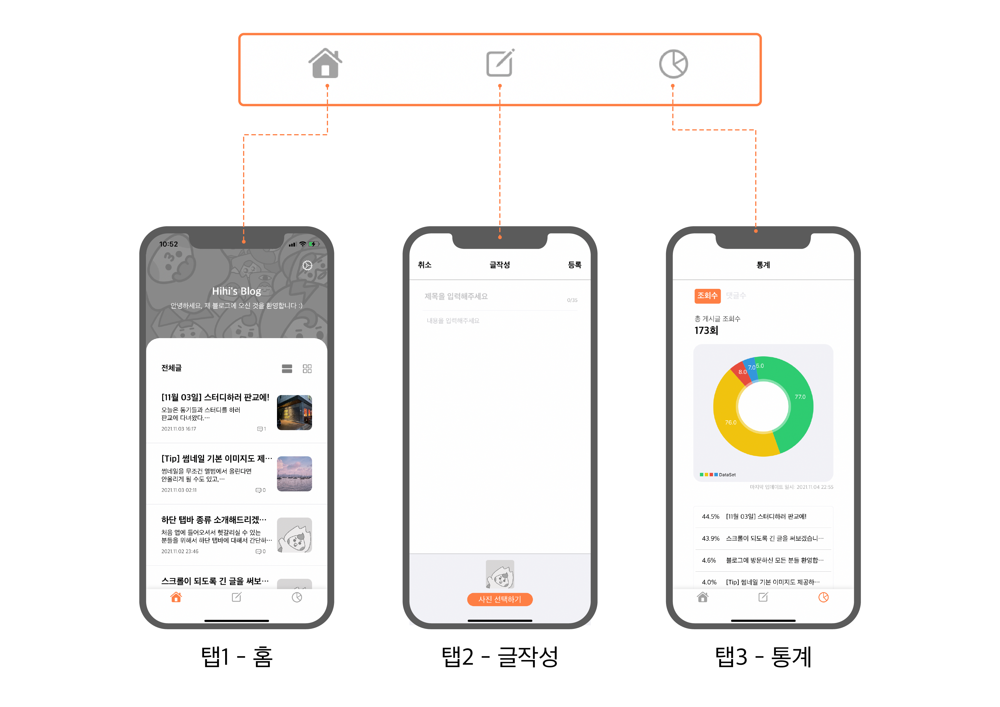
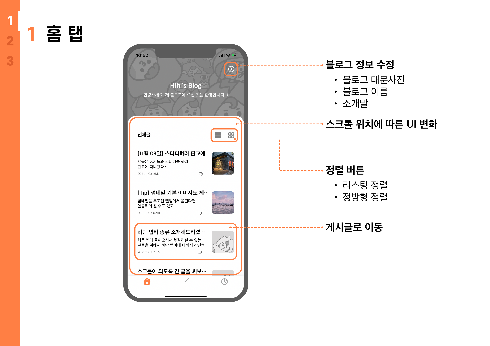
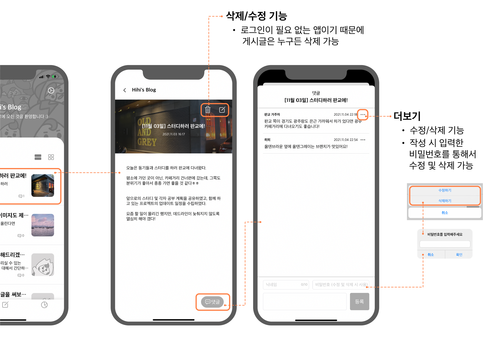
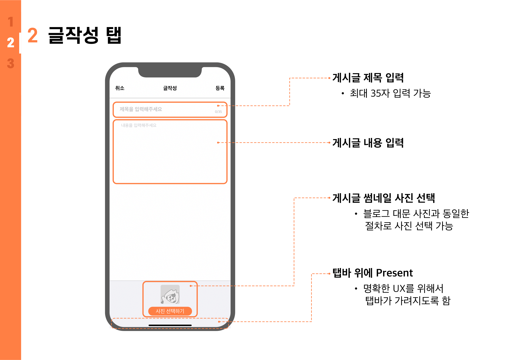
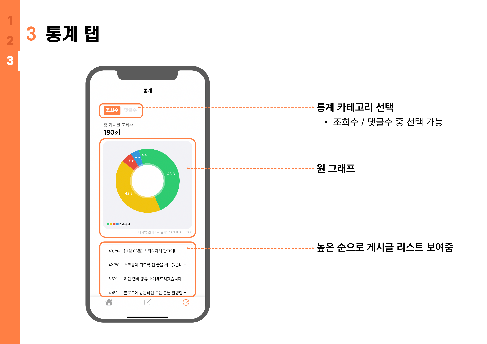
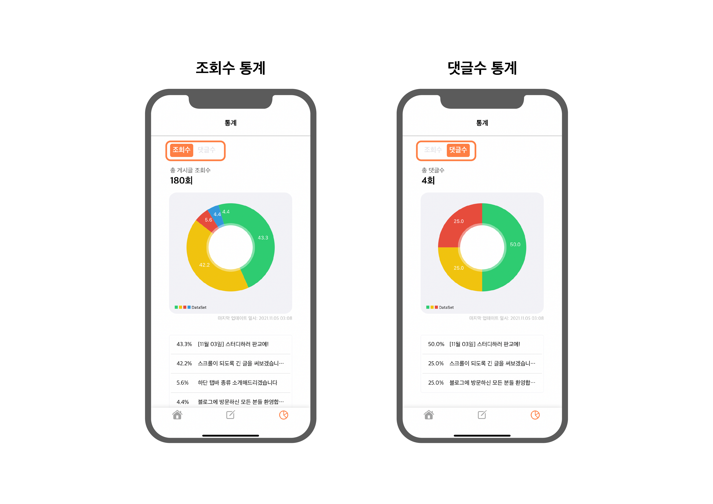
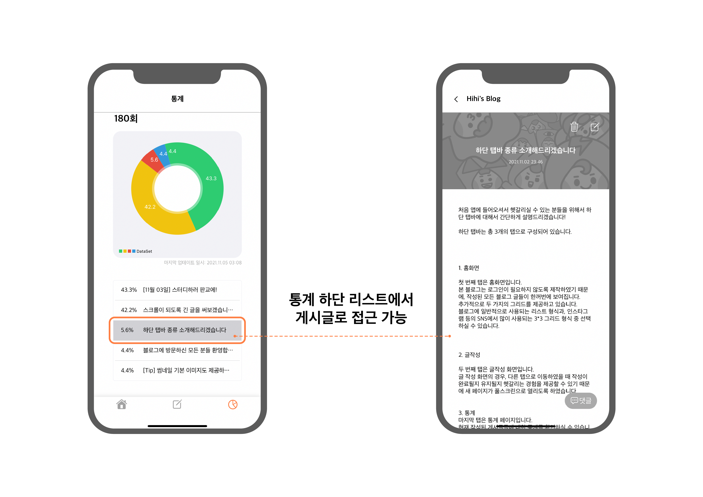

# bl.g
> 블로그 어플리케이션입니다.
특정 앱을 클론코딩한 것은 아니고, 여러 앱을 참고하여 블로그 서비스를 구현하였습니다.

*로그인이 되어있다는 것은 전제로 한 앱입니다. 댓글 수정 및 삭제를 제외한 모든 동작을 앱을 설치한 누구나 수행할 수 있습니다.


## Intallation
1. 개별적으로 Firebase 세팅을 진행해주세요.
    * 번들 ID: com.chaehui.Blog-Application
    * 3단계까지 진행: <https://firebase.google.com/docs/ios/setup?hl=ko>


2. Firebase에서 Realtime Database를 설정해주세요
    * 보안 규칙을 `테스트 모드에서 시작`으로 설정해주세요


3. `Podfile` 파일에 아래 코드가 잘 입력되어 있는지 확인해주시고, 안 되어 있다면 추가해주세요
    ```sh
      pod 'Firebase/Analytics'
      pod 'Firebase/Database'
      pod 'Firebase/Storage'
      pod 'Charts'
    ```


4. pod을 설치하세요
    ```sh
    $ cd your-project-directory
    ```
    ```sh
    $ pod install
    ```


5. .xcworkspace파일을 열어서 앱을 실행하실 수 있습니다.


## Features
본 앱은 3개의 탭(홈, 글작성, 통계)으로 구성되어 있습니다.



#### 1) 홈탭






#### 2) 글작성 탭



#### 3) 통계 탭





## Tech/Framework
* Swift
* Combine
* Firebase
* Charts

